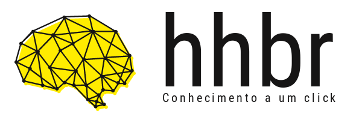

# Manual de identidade visual do canal [hhbr](https://www.youtube.com/hhbr-tech)

Repositório direcionado para centralizar arquivos e documentos voltados  a identidade visual do canal hhbr.

Não é permitido o uso inadequado da marca.

# Detalhes
    
- Cores 
    - Amarelo 
        - #FFEC00
    - Preto
        - #161515
- Font
    - hhbr
        - Roboto Condensed
    - Slogan
        - Roboto Condensed

## [Horizontal](/img/logo_horizontal)

JPG

PNG

PNG Transparente

## [Vertical](/img/logo_vertical)

JPG

PNG

PNG Transparente

# [Símbolo]()

PNG 

# Formas Para Contato

- Site: [http://hhbr.net.br](http://hhbr.net.br)
- Canal Youtube: [hhbr](https://youtube.com/hhbrtech)
- E-mail: hackershousebr@gmail.com
- Twitter: [@hackershousebr](twitter.com/hackershousebr)

# Licença

Está sobe a [licença BSD-3-Clause](LICENSE)